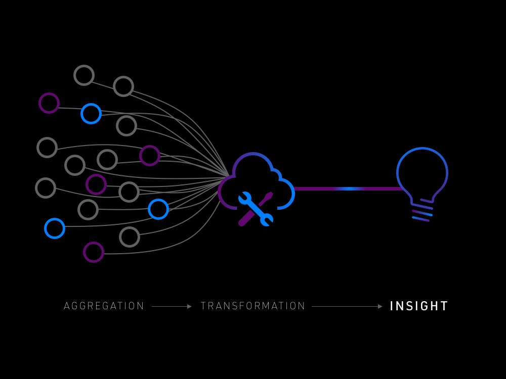

# Jens Johnson APIs

<small><b>Let's Get In Touch:</b></small>

[![jens-johnson.com](https://img.shields.io/badge/-jens--johnson.com-grey?style=for-the-badge&link=https://jens-johnson.com&color=303030&logo=data:image/png;base64,iVBORw0KGgoAAAANSUhEUgAAAB4AAAAeCAYAAAA7MK6iAAAAAXNSR0IArs4c6QAAAsZJREFUSEvdlj9uFUEMxj9LSFAgEU5AUlIBJyA3AEoqwgkIFS2cIOEECRVlQkUJOQGhogRuABIFBZLRz7JX82Z3eU8iTw9habW7Y4//zWd7TBsi25Bd/fuG3X1b0j1Ju5JuS+If+iLpXNJ7Sa/M7NsqWVwasbtvSTqQ9EDSsaRTM8PIQO6OM/cl7Uk6kfR0mQN/NOzuKDuS9D0VEllFiuGPZnbaOfFc0j6O9A62crOG3R3vMUrqzvKNUaIl1aQdw3wvkLuXzL6ZkaURTRrO1BFJnGe/OTOBwl0zIwu9YZf0OB2/MyUzMpxn+oGNc6lyd6Lk3M/MjNQG5d5HiQfSjRx8nF8A3ZRhBLfNjFSPKI2SDSI+bBW6OwgnzfBv5fHs8G4dROmUYTzb60GTEREBSgHOXIqvS/os6WWCLLaaGesDmbsDnKJLkq5K+plPHzG8XzM8ZCm9oh8py3/pZG8Qhj/lmUxldl1rJ2HYzG4mMEgl50S6w3sz47+AA79PMXI8BZ54c/aJB/bHvlyjJN+2hqsVIgizDACMc3cHdAAK0KEcPnsgzp09OBB7wUiWJWvopBlBfD+rVD/MxYqo3luUVCpABKUYjSw0/7WOERwqEOIY8pVJEI/s6yHidR3mlN443k2Cqy+nK5IohZ5Yv5wDo+WNSiWZLeDG5dRrd3fOhM610OIS9dGxqndnz6Z10o97+UJzAMrM2hqf7FzRe/sWlyU18PJiAFiYQAujMWVjdifyV2qZhcxRW8ySCqfcHcWUzeEMgCg7BsaOmbUzPMTnxiLwD+h3Q6AmUTSNuUGSEZeOydG57CKAoSHyZjJd65t+G3XKvcsr0OoXgVLSGDoysxcZCallei2AJXmsPclLwOQEK92rXvYwVvcvLntDCSba7yafTvWG4f9Xl70ufUQDYKqn30j+1+Z6S6ldzPV2Xa10aar/O8O/AX4gWaL6jIupAAAAAElFTkSuQmCC)](https://jens-johnson.com)

## Introduction

This repository holds the code infrastructure for my personal APIs as a monorepo deployment containing 
individualized services.

### Personal APIs?

What exactly does personal API mean in this context, and why do these exist?

#### Information is Powerful

As I've progressed in my career, personal hobbies, goals, and projects, I've cultivated a passion for gathering, 
analyzing and using data.

Data is involved in quite literally every single aspect of our lives, from the transactions that are generated from 
swiping our card to buy a tank of gas to the millisecond-by-millisecond adjustments that our brains make to control 
our motor actions.

Learning how to interpret, transform, analyze, and leverage the millions of data points that are generated in my daily 
routine has been a fundamental impetus for this project, and something I've already been doing on a frequent basis. 
For example:

- Tracking and budgeting my income, spending, and savings
- Creating and adjusting training plans using data from my runs and workouts
- Creating to-do's and agendas for the week, grocery lists, etc.
- Planning travel itineraries
- And the list goes on...

#### Centralized Resource Management

With an emphasis on tracking data, I've acquired a diverse set of access patterns, storage frameworks, and 
applications for doing so. For example, even at the time of this project's creation:

- Having multiple accounts and applications for each of my various credit cards, investments, etc.
- Using different applications for my fitness training, such as Strava, Garmin, and Apple Health
- Several task boards and to-do applications for my weekly agenda, shopping, etc.
- Mood tracking and journaling apps on my iPhone
- Different source control repositories for my software projects
- A multitude of office automation accounts to store documents, photos, etc.
- And I've lost count at this point of the number of various email accounts, profile registrations, and 
  account-related information that is tied to my name.

Disparate systems for maintaining all of this data has obvious advantages, the simplest of which being that I don't 
have to "reinvent the wheel" when I want to track or analyze something. For example, I'm not going to recreate a 
fitness watch software for tracking a run, or design a new interface for looking at my bank data.

However, this also creates a central issue in information access and analysis. In a practical example, let's say I 
wanted to get a better understanding of how my weekly tasks and workload affect my mood. This is a data use case 
that has valuable implications in adjusting my schedule and optimizing how I structure my life in general. To do 
this, I'd have to do something like pull data from each of the sources that create these data points (i.e. task 
tracking apps, journal and mood data), and create a manual analysis of the results. This is time-consuming, 
resource-intensive, and an overall inefficient way of solving the problem/meeting that goal.

Creating a pattern for centralized data access to the information that I want to gather and interpret provides:

- **Security**, allowing me to securely store and retrieve data,
- **Efficiency**, with a single access point to what I'm looking to retrieve, and
- **Granularity**, providing well-defined outputs consisting of the exact information that I'm seeking

As a software engineer, this is a principle that is ingrained into solution design patterns that I work with every 
day. If I'm creating a service for a user, I'll likely aggregate data from multiple sources, transform it, and 
deliver it to them. Why not apply this to how I utilize information in my own life?

### The Vision

Everything that was just discussed is both very abstract and simple. In short, I want to aggregate and analyze 
information about my personal life. However, what information that consists of, and how its acquired, interpreted, 
and provided, is still very much going to be captured in the evolution of this project.

Moving forward, this repository will serve to provide the code infrastructure that defines and supports the 
underlying services and infrastructure needed to fit my information and data use cases.

---

## [`docs`](docs)
Various documentation